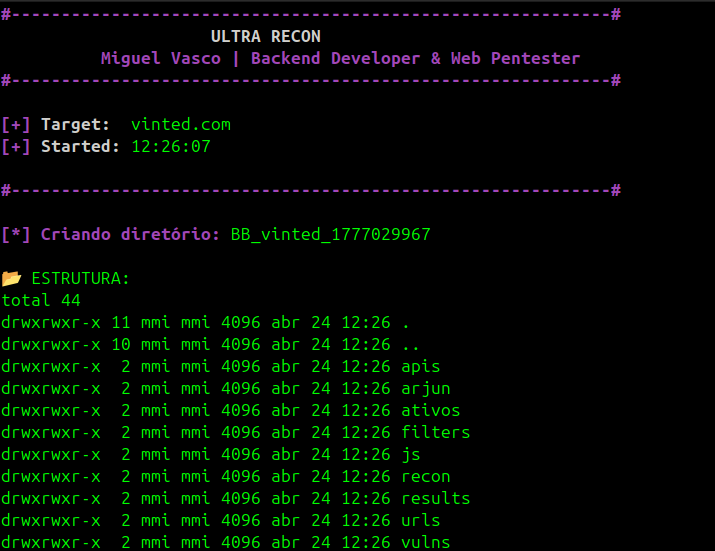

# 🚀 ULTRA RECON - Miguel Vasco



**Automated Web Pentest Reconnaissance Framework**
Developed by **Miguel Vasco**, Ultra Recon is a streamlined automation suite designed for high-efficiency reconnaissance. It maps attack surfaces, filters potential vulnerabilities using logic-based patterns, and validates findings with template-based scanning.
 
## 🛠️ Core Workflow
The tool follows a professional reconnaissance pipeline:
 1. **Passive Recon:** Subdomain discovery via Subfinder and Crt.sh.
 2. **Validation:** Live host checking using HTTPX.
 3. **Endpoint Mining:** Deep crawling with Katana, Wayback Machine and GAU.
 4. **Parameter Discovery:** Hidden parameter fuzzing with Arjun.
 5. **Smart Filtering:** Pattern matching with GF and custom Grep logic.
 6. **Vulnerability Scanning:** Automated validation via Nuclei.
## 🚀 Getting Started
### 1. Prerequisites
This tool is designed for Linux (Kali, Parrot, or Ubuntu). You will need sudo privileges for the initial setup.
### 1. Enviroment Setup (Recommeded)
You can install all necessary Go, Python, and System dependencies using the built-in installer:

git clone https://github.com/Miguel-Vasco7/Recon_Ultra.git
cd Recon_Ultra

python3 -m venv venv
source venv/bin/activate

chmod +x install_dependencies.sh
./install_dependencies.sh
```
## 💻 Usage
Once the installation is complete, refresh your shell and start scanning:
```bash
source ~/.bashrc

./ultra_recon.sh exemplo.com
```
## 📁 Output Structure
Ultra Recon organizes results into specialized directories for easy analysis:
 * /recon: Raw and cleaned subdomain lists.
 * /ativos: Validated live hosts.
 * /urls: Crawled endpoints and cleaned URL sets.
 * /filters: Potential vulnerabilities grouped by type (XSS, SQLi, LFI).
 * /vulns: **Confirmed** findings validated by Nuclei.
 * /results: A final REPORT.md with executive statistics.
## 🛡️ Tools Utilized

| Tool | Purpose |
| :--- | :--- |
| **Subfinder** | Passive Subdomain Discovery |
| **HTTPX** | Service Probing & Status Codes |
| **Katana** | Modern Web Crawling |
| **GAU** | Fetching Known URLs |
| **Arjun** | HTTP Parameter Discovery |
| **Nuclei** | Template-based Vulnerability Scanning |
| **URO / GF** | URL Cleaning and Pattern Filtering |

## ⚖️ Disclaimer
*This tool is intended for educational purposes and authorized security auditing only. The developer is not responsible for any misuse or damage caused by this program.*
